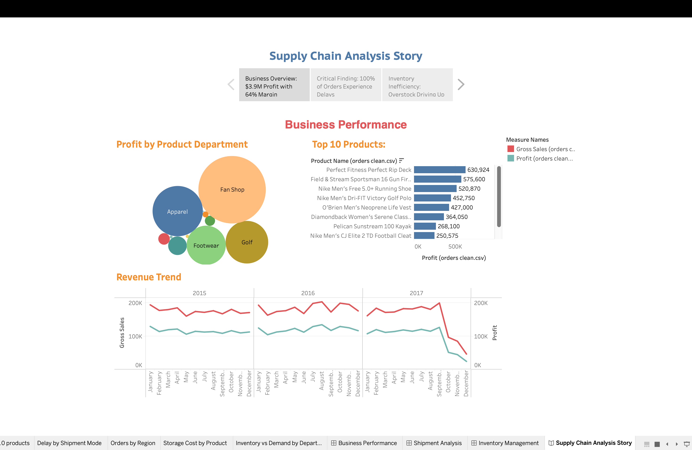
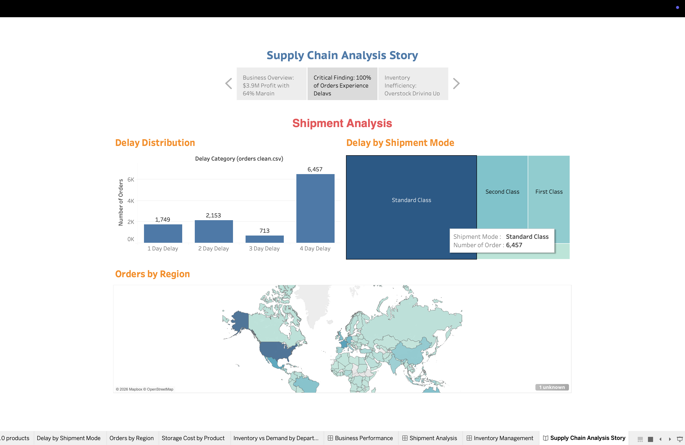
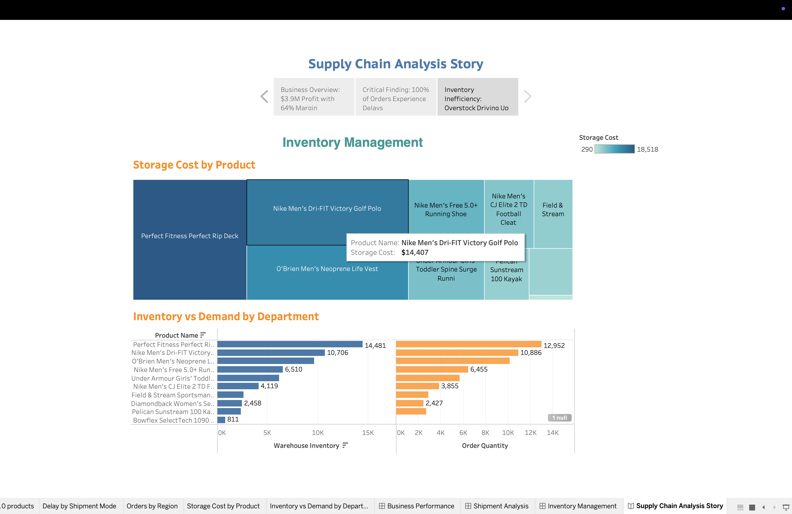

# End-to-End Supply Chain Analysis

A comprehensive supply chain analytics project analyzing shipment delays,
inventory management, and business performance across 30,871 orders for a
fictional company "Just In Time".

---

## Project Overview

This project replicates the work of a supply chain analyst — cleaning raw data,
writing SQL queries to answer business questions, calculating KPIs, building
visualizations, and delivering an automated PDF report for stakeholders.

**Dataset:** 3 tables — Orders & Shipments (30,871 rows), Inventory (4,200 rows),
Fulfillment (118 rows)

---

## Tools & Technologies

- **Python** — pandas, matplotlib, seaborn, reportlab
- **SQL** — DuckDB for query-based analysis
- **Jupyter Notebook** — KPI analysis and visualizations
- **Git** — version control

---

## Project Structure

```
end-to-end-supply-chain-analysis/
├── data/
│   ├── raw/                        # Original CSV files
│   └── processed/                  # Cleaned data outputs
├── notebooks/
│   ├── Supply_Chain_Analytics.ipynb  # Data cleaning & preprocessing
│   └── kpi_analysis.ipynb            # KPI calculations & charts
├── sql/
│   ├── load_data.py                  # Loads CSVs into DuckDB
│   ├── shipment_delay_analysis.sql   # Delay rate by mode, region, product
│   ├── inventory_turnover.sql        # Turnover ratio & carrying cost
│   ├── business_performance.sql      # Profit & revenue analysis
│   ├── order_fulfillment.sql         # Fulfillment days & perfect order rate
│   └── supply_demand_gap.sql         # Overstock & understock analysis
├── reports/
│   ├── supply_chain_report.pdf       # Auto-generated stakeholder report
│   └── chart1-4 PNG files            # Individual chart exports
├── generate_report.py                # Run this to regenerate the PDF report
├── run_queries.py                    # Run this to execute all SQL queries
└── requirements.txt
```

---

## KPI Scorecard

| Metric                | Value       | Status          |
| --------------------- | ----------- | --------------- |
| Total Orders          | 30,871      | -               |
| Total Revenue         | $6,181,476  | -               |
| Total Profit          | $3,994,192  | -               |
| Profit Margin         | 64.62%      | Healthy         |
| Avg Shipment Delay    | 3.07 days   | Needs Attention |
| Orders Delayed 4 Days | 58.3%       | Critical        |
| Total Storage Cost    | $86,430     | -               |
| Inventory Surplus     | 4,647 units | Needs Attention |

---

## Key Findings

1. **100% of orders are delayed** — shipment delays range from 1 to 4 days,
   with 58.3% experiencing the maximum 4-day delay. This points to a systemic
   logistics issue rather than isolated incidents.

2. **Fan Shop drives 41% of total profit** — generating $1.64M, followed by
   Apparel ($912K) and Golf ($655K). These three departments account for 80%
   of all profit.

3. **Apparel and Golf are significantly overstocked** — inventory surplus is
   highest in these departments, increasing carrying costs without proportional
   revenue return.

4. **Perfect Fitness Perfect Rip Deck is the top product** — generating $630,924
   in profit, nearly 16% of total company profit from a single SKU.

5. **Revenue declined sharply in late 2017** — after stable performance from
   2015 to mid-2017, a significant drop requires further root cause investigation.

---

## How to Run

**1. Install dependencies**

```bash
pip install -r requirements.txt
```

**2. Load data into DuckDB**

```bash
python sql/load_data.py
```

**3. Run all SQL queries**

```bash
python run_queries.py
```

**4. Generate PDF report**

```bash
python generate_report.py
```

**5. Open KPI notebook**

```bash
jupyter notebook notebooks/kpi_analysis.ipynb
```

## Tableau Dashboard Story





---

## Recommendations

1. **Investigate shipment delays** — conduct root cause analysis on logistics
   partners and warehouse processing times
2. **Reduce overstock in Apparel and Golf** — run targeted promotions and
   reduce purchase orders to cut carrying costs
3. **Protect top SKU availability** — ensure Perfect Fitness Rip Deck and top
   Nike products are never out of stock
4. **Review underperforming departments** — Book Shop, Pet Shop and Health &
   Beauty generate under $5,000 each in profit
5. **Investigate the 2017 revenue decline** — determine if seasonal, operational,
   or market-driven

---

## Dataset Source

Original dataset from [DataCamp Supply Chain Analytics competition](https://github.com/poojapatel26/Supply-Chain-Analytics).
Analysis, SQL layer, KPI framework, visualizations and report generation are original work.
