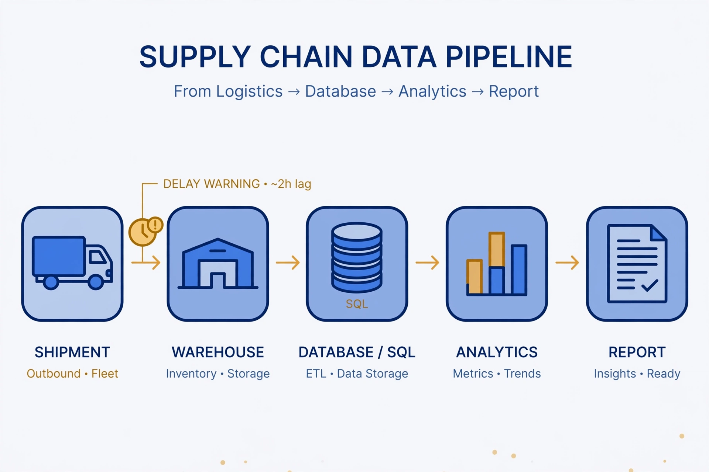
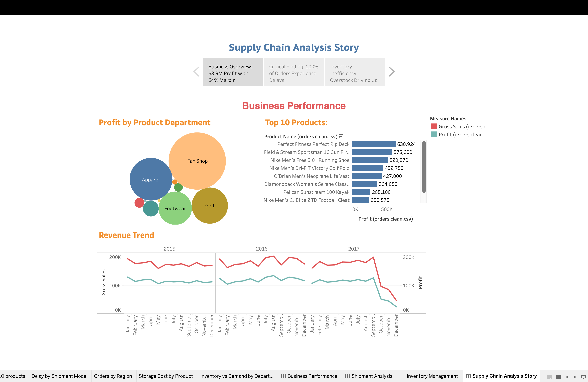
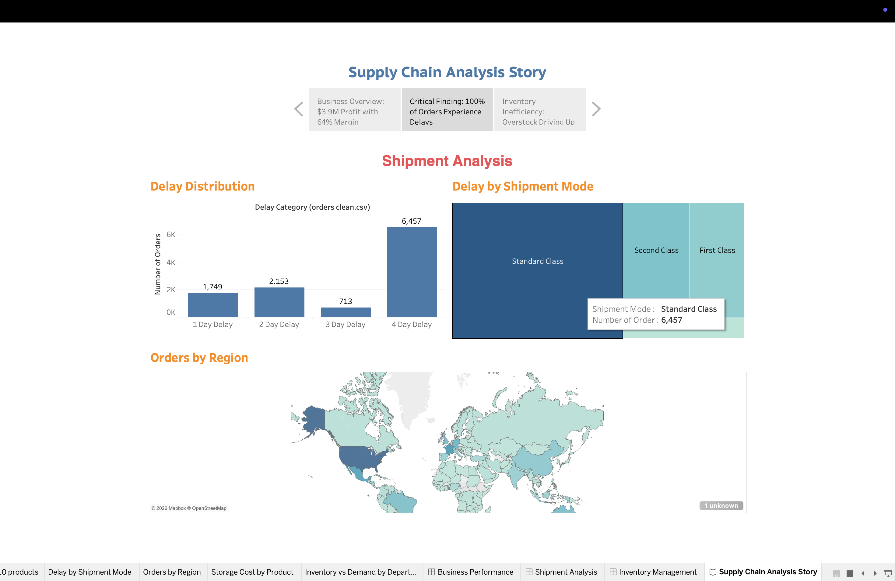
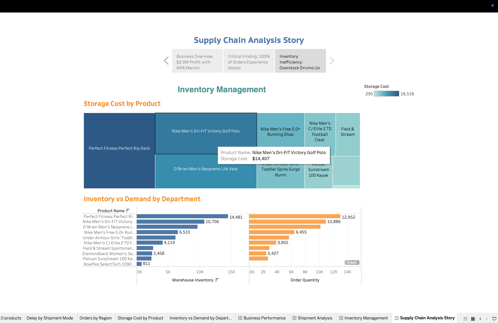

# 🚚 End-to-End Supply Chain Analysis: Shipment, Inventory, and Profitability Intelligence



_Turning 30,871 real order and shipment records into a systemic diagnosis of delivery failure, overstock, and profit concentration for a fictional company, "Just In Time."_

---

## 🧩 Overview

**End-to-End Supply Chain Analysis** replicates the day-to-day work of a supply chain analyst: cleaning raw operational data, writing SQL to answer specific business questions, calculating KPIs, building visualizations, and delivering an automated stakeholder-ready PDF report, on a real, publicly available dataset rather than a synthetic one.

The dataset spans three tables: Orders & Shipments (30,871 line items), Inventory (4,200 rows), and Fulfillment (118 rows), covering a multi-year operating history for the company.

---

## 🎯 The Problem

> Why do shipments keep arriving late, which departments are actually making money, and where is inventory sitting in the wrong place?

Before this analysis, the answers to these questions were scattered across raw operational exports with no shared framework for measuring delay, profitability, or stock health. This project builds that framework once, in SQL, so every downstream question, "which shipment mode is worst," "which department should we invest in," "where are we overstocked," gets answered consistently from the same source of truth.

---

## 💡 Motivation

Real operational data is messier and less forgiving than a synthetic dataset. This project was deliberately built on a genuine, publicly sourced dataset (see Dataset Source below) specifically to demonstrate comfort working with real-world data quality issues, encoding problems, inconsistent column naming, embedded whitespace, rather than a dataset engineered to be clean from the start.

---

## 🧬 Core Idea

The pipeline moves from raw operational exports to a stakeholder-facing report in five stages:

1. **Load** three raw CSVs into an analytical database (Python, DuckDB)
2. **Clean** encoding issues, whitespace, and inconsistent typing (Python, pandas)
3. **Analyze** with five focused SQL scripts answering specific business questions
4. **Visualize** KPIs and trends in a Jupyter notebook
5. **Report** findings automatically into a stakeholder-ready PDF, plus a separate Tableau-ready export

---

## 🧠 Why It Matters

- Demonstrates fluency with a genuine, messy, real-world dataset (encoding issues, inconsistent column naming, embedded whitespace) rather than a synthetic one engineered to be clean.
- Uses DuckDB, an in-process analytical database built specifically for fast SQL over local files, an increasingly common tool in modern analytics workflows and a meaningful signal of staying current with the field.
- Closes the loop from raw data to a stakeholder-facing deliverable (an automatically generated PDF report), not just a notebook that stops at analysis.

---

## 🧰 Tools and Technologies

| Category                  | Stack                                    |
| ------------------------- | ---------------------------------------- |
| **Language**              | Python                                   |
| **Analytical Database**   | DuckDB (in-process SQL over local files) |
| **Data Manipulation**     | pandas                                   |
| **Visualization**         | matplotlib, seaborn                      |
| **Reporting**             | reportlab (automated PDF generation)     |
| **Notebook Environment**  | Jupyter                                  |
| **Business Intelligence** | Tableau (dedicated cleaned export)       |
| **Version Control**       | Git, GitHub                              |

---

## 🧩 Methodology

### Phase 1. Data Loading

Three raw CSVs (Orders & Shipments, Inventory, Fulfillment) loaded into a DuckDB database file. Column names are stripped of embedded whitespace at load time, a real quirk of the source export, and the file is read with explicit `latin-1` encoding rather than the default UTF-8, since the raw export was not UTF-8 clean.

### Phase 2. Data Cleaning

A separate cleaning pass (`export_for_tableau.py`) handles the messier transformations: converting a text placeholder (`" - "`) in the discount column to a proper zero, taking the absolute value of shipment delay days, deriving a proper `Order Date` from separate year, month, and day columns, and calculating profit margin per order. This produces both a Tableau-ready export and a cleaned dataset for the notebook-based KPI analysis.

### Phase 3. SQL Analytics Layer

Five focused SQL scripts, each answering a specific operational question:

| Script                        | Business Question                             | SQL Technique                          |
| ----------------------------- | --------------------------------------------- | -------------------------------------- |
| `shipment_delay_analysis.sql` | How many orders are delayed, and by how much? | Conditional aggregation, `GROUP BY`    |
| `business_performance.sql`    | Which departments and products drive profit?  | Multi-level aggregation, ranking       |
| `inventory_turnover.sql`      | How efficiently is inventory moving?          | Turnover ratio calculation             |
| `order_fulfillment.sql`       | How long does fulfillment actually take?      | Date-based aggregation                 |
| `supply_demand_gap.sql`       | Where is inventory mismatched with demand?    | Multi-table join, conditional flagging |

### Phase 4. KPI Analysis and Visualization

A Jupyter notebook (`kpi_analysis.ipynb`) calculates the headline KPIs and produces the chart set (shipment delay distribution, profit by department, stock status, top products, monthly revenue trend) used in the final report.

### Phase 5. Automated Reporting

`generate_report.py` assembles the KPIs, charts, and findings into a single PDF via reportlab, the kind of artifact that gets emailed to stakeholders rather than a notebook they'd need to run themselves.

---

## 📊 KPI Scorecard

| Metric                              | Value       | Status          |
| ----------------------------------- | ----------- | --------------- |
| Total Orders                        | 30,871      | -               |
| Total Revenue                       | $6,181,476  | -               |
| Total Profit                        | $3,994,192  | -               |
| Profit Margin                       | 64.62%      | Healthy         |
| Average Shipment Delay              | 3.07 days   | Needs attention |
| Orders Delayed the Maximum (4 Days) | 58.3%       | Critical        |
| Total Storage Cost                  | $86,430     | -               |
| Inventory Surplus                   | 4,647 units | Needs attention |

---

## 🔍 Key Findings

| Finding                                                | Evidence                                                                                                                                                  |
| ------------------------------------------------------ | --------------------------------------------------------------------------------------------------------------------------------------------------------- |
| Every single order in the dataset shipped late         | 100% delay rate; delays cluster heavily at the 4-day maximum (58.3% of all orders), pointing to a systemic logistics issue rather than isolated incidents |
| Fan Shop drives 41% of total company profit            | $1.64M, more than Apparel ($912K) and Golf ($655K) combined; these three departments account for roughly 80% of all profit                                |
| Apparel and Golf are significantly overstocked         | Inventory surplus concentrates in these two departments, adding carrying cost without a proportional revenue return                                       |
| A single SKU drives nearly 16% of total company profit | The Perfect Fitness Perfect Rip Deck generated $630,924 in profit alone                                                                                   |
| Revenue dropped sharply in late 2017                   | After stable performance from 2015 through mid-2017, the decline is a clear candidate for root cause investigation, not explained by the data alone       |

---

## 🎨 Dashboards and Reports

**Tableau Story:** three-page visual narrative built on the cleaned export





**PDF Report:** `reports/supply_chain_report.pdf`, generated automatically by `generate_report.py`, combining the KPI scorecard, five supporting charts, and written findings into a single stakeholder-ready document.

---

## 🧠 Architectural Decisions and Tradeoffs

- **DuckDB over a traditional server-based database**: for a project of this scale, DuckDB's in-process, file-based design avoids the overhead of standing up and maintaining a separate database server, while still supporting full SQL, including joins and window functions, directly over the cleaned CSVs.
- **A dedicated cleaning script separate from the SQL layer**: encoding and formatting issues (the discount placeholder, the raw delay sign, the split date columns) are resolved once in Python before any SQL runs, rather than working around them repeatedly inside individual queries.
- **A generated PDF as the final deliverable, not just a notebook**: notebooks are excellent for exploration but are not what most stakeholders want to open. Closing the loop with an automatically generated report reflects how this kind of analysis actually gets consumed in a real organization.

---

## ⚠️ Limitations and Future Directions

- The 100% delay rate across every single order is a striking finding that the current analysis surfaces but does not fully explain; a natural next step is joining in carrier- or route-level detail, if available, to isolate whether delay is concentrated by shipment mode, region, or specific logistics partner.
- The sharp revenue decline in late 2017 is flagged but not diagnosed; this would benefit from an external data join (promotions calendar, macro indicators, or competitor activity) to distinguish seasonal, operational, and market-driven causes.
- The supply-versus-demand gap analysis currently compares average inventory to average demand per department; a time-aware version tracking the gap month by month would better support actual reorder-point decisions.

---

## 🛠️ How to Run

```bash
# 1. Install dependencies
pip install -r requirements.txt

# 2. Load data into DuckDB
python sql/load_data.py

# 3. Run all SQL queries
python run_queries.py

# 4. Generate the PDF report
python generate_report.py

# 5. Open the KPI notebook
jupyter notebook notebooks/kpi_analysis.ipynb
```

---

## 👩‍💻 Author

**Naga Hema Ramishetty**
Data Analyst
**GitHub:** [github.com/nagahemaramishetty](https://github.com/nagahemaramishetty)

---

## 🧭 Keywords

`SQL` · `DuckDB` · `Python` · `pandas` · `Data-Cleaning` · `Supply-Chain-Analytics` · `Business-Intelligence` · `Tableau` · `Automated-Reporting` · `Data-Analyst-Portfolio`

---

## 📚 Dataset Source

Original dataset from the [DataCamp Supply Chain Analytics competition](https://github.com/poojapatel26/Supply-Chain-Analytics). The data cleaning pipeline, SQL analytics layer, KPI framework, visualizations, and automated report generation in this repository are original work.

---

_This repository demonstrates that real operational data, not just synthetic data, can be turned into a trustworthy, stakeholder-ready analysis, encoding issues and all._
